# لیست کامل پزشکان بیمارستان امید

**تاریخ استخراج:** ۲۱ تیر ۱۴۰۴
**تعداد کل:** 199 پزشک
**پزشکان فعال:** 186
**پزشکان مرحوم (یادبود):** 13

---

## 🕊️ پزشکان مرحوم — 13 نفر

| # | نام پزشک | تخصص | تصویر |
|---|----------|------|-------|
| 1 | مرحوم آقای دکتر سیاوش صالح علوی | زنان | 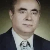 |
| 2 | مرحوم آقای دکتر بهزاد فراهانی | قلب و عروق | 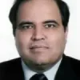 |
| 3 | مرحوم آقای دکتر سید علی کاظمی | قلب و عروق | 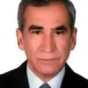 |
| 4 | مرحوم آقای دکتر احمد زاهدی | گوش و حلق و بینی | 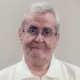 |
| 5 | مرحوم آقای دکتر جعفر باقری | جراح عمومی | — |
| 6 | مرحوم آقای دکتر حمید میرخانی | جراحی قلب | 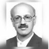 |
| 7 | مرحوم آقای دکتر قاسم علیزاده میزانی | چشم | 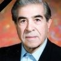 |
| 8 | مرحوم آقای دکتر مرتضی شرکت | ارتوپد | — |
| 9 | مرحوم آقای دکتر حسین سامی راد | گوش و حلق و بینی | — |
| 10 | مرحوم آقای دکتر مرتضی هاشمی | گوارش | 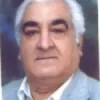 |
| 11 | مرحوم آقای دکتر شهرام خسروی نژاد | قلب و عروق | 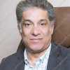 |
| 12 | مرحوم آقای دکتر جعفر رجائی پور | جراح عمومی | 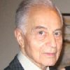 |
| 13 | مرحوم آقای دکتر موسی عدالت | ارتوپد | — |

---

## 👨‍⚕️ پزشکان با قابلیت رزرو نوبت — 21 نفر

| # | نام پزشک | تخصص | تصویر |
|---|----------|------|-------|
| 1 | آقای دکتر عدنان تیزمغز | فوق تخصص جراحی و  زیبایی پستان | 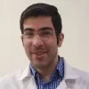 |
| 2 | خانم دکتر شکیبا امیرجانی | زنان | 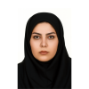 |
| 3 | خانم دکتر سعیده صادقی | داخلی | 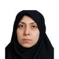 |
| 4 | خانم دکتر مریم یوسفی کوشا | ENT | 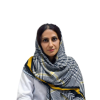 |
| 5 | آقای دکتر نوید لطف زرعی | روان پزشک |  |
| 6 | آقای دکتر مزدک عالی خانی | جراحی ستون فقرات | 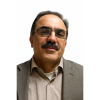 |
| 7 | خانم دکتر فروغ صالحین | زنان | 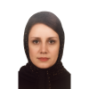 |
| 8 | خانم دکتر سحر اصلانی | زنان | 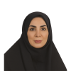 |
| 9 | آقای دکتر سیدحمیدرضا هاشمی فرد | آنکولوژی | 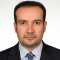 |
| 10 | سرکار خانم زهرا صفایی | تغذیه | 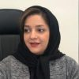 |
| 11 | خانم دکتر خدیجه میرزازاده | روانشناس | 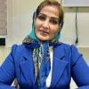 |
| 12 | سرکار خانم سوسن گلبن | ادیومتری | 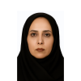 |
| 13 | آقای دکتر داوود نوروزی | چشم | 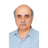 |
| 14 | دکتر مرجان خیام زاده | غدد | 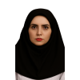 |
| 15 | آقای دکتر محمد مسعود ذاکر | ریه |  |
| 16 | خانم دکتر مرجان شمس | جراحی عمومی | 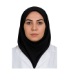 |
| 17 | دکتر محمودرضا عسگری | جراحی عمومی | 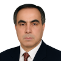 |
| 18 | دکتر سید محمد موسوی | اورولوژی | 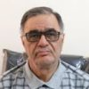 |
| 19 | آقای دکتر احمد بهرامی | اطفال |  |
| 20 | خانم دکتر سیما ایوبی | اطفال | 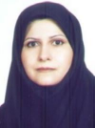 |
| 21 | دکتر سیروس ملک پور | ارتوپدی | 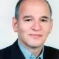 |

---

## 📋 همه پزشکان فعال — 186 نفر

| # | نام پزشک | تخصص | نوبت‌دهی |
|---|----------|------|----------|
| 1 | آقای دکتر عدنان تیزمغز | فوق تخصص جراحی و  زیبایی پستان | ✅ دارد |
| 2 | جناب آقای مهرزاد امیری | ژنتیک | — |
| 3 | آقای سید محمد احمدی نژاد | طب اورژانس | — |
| 4 | خانم دکتر طاهره اشراقی | بیهوشی | — |
| 5 | آقای دکتر جمشید فرخانی | جراح مغز و اعصاب | — |
| 6 | آقای دکتر امیرحسین بیگدلی | جراح عمومی | — |
| 7 | خانم دکتر هدیه بیگدلی | طب کار | — |
| 8 | خانم دکتر سیما یعقوبی | زنان | — |
| 9 | آقای دکتر داود یادگاری نیا | عفونی | — |
| 10 | خانم دکتر فروزان وهاب زاده | پاتولوژی | — |
| 11 | آقای دکتر محمد نصیری جهرودی | عمومی | — |
| 12 | آقای دکتر مهدی ناقوسی | بیهوشی | — |
| 13 | خانم دکتر آزیتا میرچی | پاتولوژی | — |
| 14 | خانم دکتر مژگان میرآخورلی | ژنتیک | — |
| 15 | آقای دکتر فرهاد موسی زاده | جراحی پستان | — |
| 16 | آقای دکتر سید محمد موسوی | کلیه و مجرای ادرار | — |
| 17 | آقای دکتر مهدی مهدی زاده | فیزیوتراپی | — |
| 18 | آقای دکتر مهدی مقتدایی | ارتوپد | — |
| 19 | آقای دکتر مجید مظاهری | گوش و حلق و بینی | — |
| 20 | آقای دکتر اصغر مزارعی | قلب و عروق | — |
| 21 | آقای دکتر نیما فلاح | دارو ساز | — |
| 22 | آقای دکتر محمد فکور | ارتوپد | — |
| 23 | خانم دکتر پریسا مرادی | زنان | — |
| 24 | خانم دکتر نسیم مرادی | زنان | — |
| 25 | آقای دکتر سید محمد مدینه ای | زنان | — |
| 26 | خانم دکتر منیر محمدی | عفونی | — |
| 27 | خانم دکتر مریم محبی | زنان | — |
| 28 | خانم زهرا متحملیان | فیزیوتراپی | — |
| 29 | آقای دکتر محمدحسین ماندگار | قلب و عروق | — |
| 30 | آقای دکتر حسین ماجدی اردکانی | بیهوشی | — |
| 31 | آقای دکتر فرنود گودرزی | رادیولوژی | — |
| 32 | خانم سوسن گلبن | شنوایی سنجی | — |
| 33 | آقای دکتر آرش گرجی زاده | بیهوشی | — |
| 34 | آقای دکتر رضا کیا | قلب و عروق | — |
| 35 | آقای دکتر منوچهر کوچک دزفولی | ارتوپد | — |
| 36 | خانم دکتر نادیا کریمی | کلیه ( نفرولوژیست) | — |
| 37 | آقای دکتر مهدی کریمی | قلب و عروق | — |
| 38 | خانم دکتر زهره کاظمی | زنان | — |
| 39 | اقای دکتر علی کاظمی خالدی | قلب و عروق | — |
| 40 | خانم دکتر مهرناز قزوینی مجاور | اطفال | — |
| 41 | آقای دکتر اسعد قدوسی طهرانی | اطفال | — |
| 42 | خانم سعیده فتوحی اردکانی | فیزیوتراپی | — |
| 43 | آقای دکتر بابک فرزاد | بیهوشی | — |
| 44 | خانم دکتر مریم فاطمی سلوط | بیهوشی | — |
| 45 | آقای دکتر امیرفرجام فاضلی فر | قلب و عروق | — |
| 46 | آقای دکتر محمد غفاری پور جهرمی | بیهوشی | — |
| 47 | آقای دکتر امیرنادر غازی | رادیولوژی | — |
| 48 | آقای دکتر مه زاد علیمیان | بیهوشی | — |
| 49 | آقای دکتر کوروش علیزاده علمداری | کلیه و مجرای ادرار | — |
| 50 | خانم دکتر زهرا علیزاده ثانی | قلب و عروق | — |
| 51 | آقای دکتر بابک علیجانی | بیهوشی | — |
| 52 | خانم دکتر محبوبه عسگری | پزشکی قانونی | — |
| 53 | آقای دکتر محمودرضا عسگری | جراح عمومی | — |
| 54 | آقای دکتر علیرضا طلوع کوروشی | تجهیزات پزشکی | — |
| 55 | خانم اعظم طباطبایی نسب | شنوایی سنجی | — |
| 56 | آقای دکتر سید جعفر طباطبایی | عمومی | — |
| 57 | خانم دکتر مهشید طالبی طاهر | عفونی | — |
| 58 | آقای دکتر سید حسین صمدانی فرد | غدد | — |
| 59 | خانم دکتر پانیذ صدیقی | بیهوشی | — |
| 60 | آقای دکتر بهزاد صدری | بیهوشی | — |
| 61 | آقای دکتر مهرداد صالحی | قلب و عروق | — |
| 62 | خانم دکتر مژگان شاه حسینی | پاتولوژی | — |
| 63 | خانم دکتر مهناز سیفی ینگجه | علوم آزمایشگاهی | — |
| 64 | خانم آزاده السادات سفیداری | کارشناس تغذیه | — |
| 65 | آقای دکتر مهرزاد سهرابی | مغز و اعصاب | — |
| 66 | آقای دکتر علی سرمست صمیمی | icu | — |
| 67 | خانم دکتر نگار سجادیان | اطفال | — |
| 68 | خانم دکتر نازیلا سبحانی گرگری | عمومی | — |
| 69 | خانم دکتر نازنین زعفرانلو | اطفال | — |
| 70 | آقای دکتر بهروز زمان | بیهوشی | — |
| 71 | آقای دکتر علیرضا زردان | بیهوشی | — |
| 72 | خانم دکتر نسیم زاهدی | پاتولوژی | — |
| 73 | آقای دکتر کاوه روستائیان | بیهوشی | — |
| 74 | خانم دکتر طاهره رضایی | زنان | — |
| 75 | آقای دکتر محمدعلی رشیدی نژاد میبدی | قلب و عروق | — |
| 76 | آقای دکتر علیرضا رحیمی | اطفال | — |
| 77 | آقای دکتر حسین راهب | مغز و اعصاب | — |
| 78 | آقای دکتر محمد علی رازانی | چشم | — |
| 79 | آقای دکتر مهرداد دانش | بیهوشی | — |
| 80 | خانم دکتر مطهره السادات حیدریان | عمومی | — |
| 81 | آقای دکتر سید حسن حیدریان | عمومی | — |
| 82 | آقای دکتر سعید حیدری | داروخانه | — |
| 83 | آقای دکتر مجید حیدری | جراح عمومی | — |
| 84 | آقای دکتر سید محمدعلی حسینی لواسانی | کولورکتال | — |
| 85 | آقای دکتر قباد حسن زاده مقدم | بیهوشی | — |
| 86 | آقای دکتر امید جوان شجاع مفرد | بیهوشی(پدر) | — |
| 87 | آقای دکتر سید مهدی جلالی | جراحی لاپاراسکوپی | — |
| 88 | آقای دکتر محمد تقی جغتایی | فیزیوتراپی | — |
| 89 | آقای دکتر مصطفی جامساز | زنان | — |
| 90 | خانم دکتر شیما ترابی صوفی | بیهوشی | — |
| 91 | آقای دکتر حمید پیراسته | کلیه ( نفرولوژیست) | — |
| 92 | آقای دکتر کامبیز پناهی شریف | جراح عمومی | — |
| 93 | آقای دکترساویز پژهان | جراحی قفسه سینه( توراکس) | — |
| 94 | خانم دکتر رزا پرستنده چهر | زنان | — |
| 95 | آقای دکتر داود پازوکی | جراحی قلب | — |
| 96 | خانم دکتر مرضیه پازوکی | ریه | — |
| 97 | آقای دکتر شهریار پارسا | جراح عمومی | — |
| 98 | آقای دکتر محمد علی بیطرف | مغز و اعصاب | — |
| 99 | خانم دکتر نازنین بقائی پور | عمومی | — |
| 100 | خانم دکتر مهین بشارتیان | زنان | — |
| 101 | خانم دکتر ستی برومند | زنان | — |
| 102 | آقای دکتر حسن آقاجانی | قلب و عروق | — |
| 103 | آقای دکتر داود آذرنگی | مغز و اعصاب | — |
| 104 | خانم دکتر سحر آشوری موثق | طب اورژانس | — |
| 105 | آقای دکتر صاحب آب روشن | بیهوشی | — |
| 106 | آقای دکتر علی آئین | جراح عمومی | — |
| 107 | خانم دکتر رویا ایزد دوست دار | زنان | — |
| 108 | آقای دکتر یاشار ایران پور | بیهوشی | — |
| 109 | خانم دکتر نگار ایران پور | بیهوشی | — |
| 110 | آقای دکتر جواد انصاری | جراح عمومی | — |
| 111 | آقای دکتر محمدرضا اعتراف اسکوئی | طب فیزیکی و توانبخشی | — |
| 112 | خانم دکتر ستاره اسعدی خامنه | رادیولوژی | — |
| 113 | خانم دکتر مریم اردشیری | غدد | — |
| 114 | آقای دکتر کورش احمدی | بیهوشی | — |
| 115 | آقای دکتر علی اصغر ابدی | ارتوپد | — |
| 116 | آقای دکتر مصطفی حسینی | جراح عمومی-جراحی سر و گردن | — |
| 117 | آقای دکتر اکبر میرشکارپور | رادیولوژی | — |
| 118 | آقای دکتر امیر مسعود عرب | فیزیوتراپی | — |
| 119 | خانم دکتر شایسته رجب زاده | فیزیوتراپی | — |
| 120 | آقای دکتر علی فراهینی | دندانپزشک | — |
| 121 | آقای دکتر علیرضا شیرزادی | جراحی پستان | — |
| 122 | آقای دکتر محمدرضا آهنی | بیهوشی | — |
| 123 | خانم دکتر نوشین نایب یزدی | بیهوشی | — |
| 124 | آقای دکتر محسن ناسوقی | بیهوشی | — |
| 125 | آقای دکتر فرزاد عبداللهی پور | جراح عمومی | — |
| 126 | آقای دکتر محمد یرانی | جراح عمومی | — |
| 127 | آقای دکتر محمدحسن شمس الاحرار | متخصص درد | — |
| 128 | آقای دکتر هژیر حیدری | طب اورژانس | — |
| 129 | آقای دکتر آرش قنواتی | قلب و عروق | — |
| 130 | آقای دکتر محمد هادی زاده | گوارش | — |
| 131 | آقای دکتر بهنام محمودیه | icu | — |
| 132 | آقای دکتر روزبه بیاتی | عفونی | — |
| 133 | آقای دکتر رضا مینایی | داخلی | — |
| 134 | آقای دکتر مهدی قهرمانی | icu | — |
| 135 | خانم دکتر لیلا مصطفایی | زنان | — |
| 136 | خانم دکتر روشنک خدادادی | زنان | — |
| 137 | آقای دکتر وحید قائد امینی | جراح عمومی | — |
| 138 | آقای دکتر نادر مطلبی زاده | ارتوپد | — |
| 139 | آقای دکتر حسین فراهینی | ارتوپد | — |
| 140 | آقای دکتر محمدعلی خبیری | icu | — |
| 141 | آقای دکتر علیرضا فرهمندی | ارتوپد | — |
| 142 | آقای دکتر امیرحسین زهره‌ ای | قلب و عروق | — |
| 143 | خانم دکتر لادن رحیمی زارچی | زنان | — |
| 144 | خانم دکتر سیده آفاق حسینی | زنان | — |
| 145 | خانم دکتر سحر آب روشن | زنان | — |
| 146 | خانم دکتر ماندانا عبدالهی | زنان | — |
| 147 | خانم دکتر مریم قلی پور | زنان | — |
| 148 | خانم دکتر زهرا حمیدی | زنان | — |
| 149 | خانم دکتر سلما رضوی | زنان | — |
| 150 | خانم دکتر عادله عاشوری | زنان | — |
| 151 | دکتر شیوا مدنی حسینی | زنان | — |
| 152 | خانم دکتر روحیه مقدسی | زنان | — |
| 153 | خانم دکتر محدثه شریفی طاسکوه | زنان | — |
| 154 | آقای دکتر حامد جوادیان | اطفال | — |
| 155 | آقای دکتر سامر مرادیان | اطفال | — |
| 156 | آقای دکتر علیرضا ابراهیمی | اطفال | — |
| 157 | آقای دکتر احسان اکرمی | اطفال | — |
| 158 | خانم دکتر پریسا ایزدیار | اطفال | — |
| 159 | خانم دکتر پریسا علیزاده | زنان | — |
| 160 | آقای دکتر احمد اسفندیار | اطفال | — |
| 161 | آقای دکتر محمدرضا بقایی پور | اطفال | — |
| 162 | خانم دکتر کتایون برجیس | زنان | — |
| 163 | آقای دکتر اسداله فغانی | اطفال | — |
| 164 | خانم دکتر شکیبا امیرجانی | زنان | ✅ دارد |
| 165 | خانم دکتر سعیده صادقی | داخلی | ✅ دارد |
| 166 | خانم دکتر مریم یوسفی کوشا | ENT | ✅ دارد |
| 167 | آقای دکتر نوید لطف زرعی | روان پزشک | ✅ دارد |
| 168 | آقای دکتر مزدک عالی خانی | جراحی ستون فقرات | ✅ دارد |
| 169 | آقای دکتر نیما محسن زاده | نورولوژی | — |
| 170 | خانم دکتر فروغ صالحین | زنان | ✅ دارد |
| 171 | خانم دکتر یاسمن کبیر | زنان | — |
| 172 | خانم دکتر سحر اصلانی | زنان | ✅ دارد |
| 173 | آقای دکتر سیدحمیدرضا هاشمی فرد | آنکولوژی | ✅ دارد |
| 174 | سرکار خانم زهرا صفایی | تغذیه | ✅ دارد |
| 175 | خانم دکتر خدیجه میرزازاده | روانشناس | ✅ دارد |
| 176 | سرکار خانم سوسن گلبن | ادیومتری | ✅ دارد |
| 177 | آقای دکتر داوود نوروزی | چشم | ✅ دارد |
| 178 | دکتر مرجان خیام زاده | غدد | ✅ دارد |
| 179 | آقای دکتر محمد مسعود ذاکر | ریه | ✅ دارد |
| 180 | خانم دکتر مرجان شمس | جراحی عمومی | ✅ دارد |
| 181 | دکتر محمودرضا عسگری | جراحی عمومی | ✅ دارد |
| 182 | دکتر سید محمد موسوی | اورولوژی | ✅ دارد |
| 183 | آقای دکتر سامان نجفی | اورولوژی | — |
| 184 | آقای دکتر احمد بهرامی | اطفال | ✅ دارد |
| 185 | خانم دکتر سیما ایوبی | اطفال | ✅ دارد |
| 186 | دکتر سیروس ملک پور | ارتوپدی | ✅ دارد |
